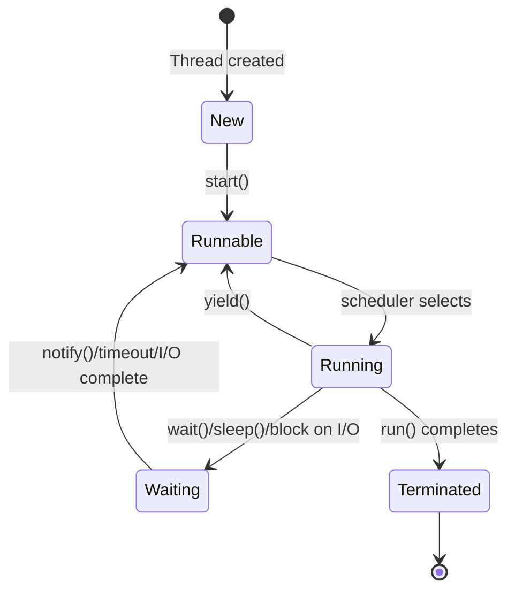
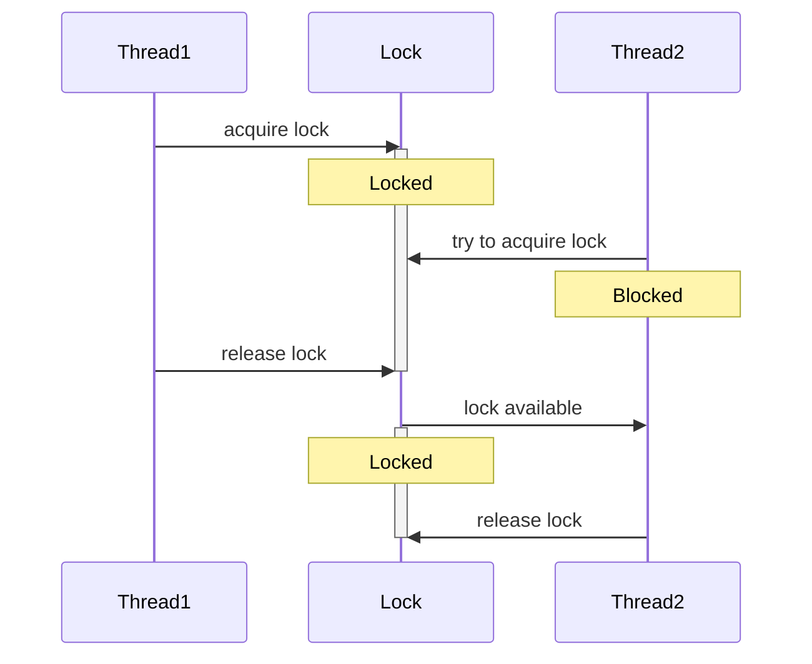
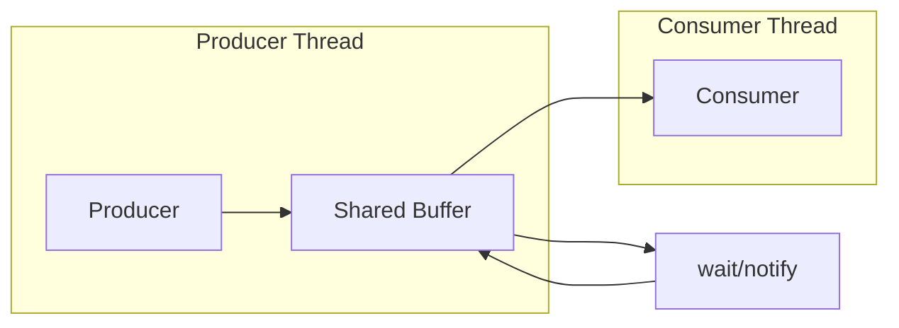
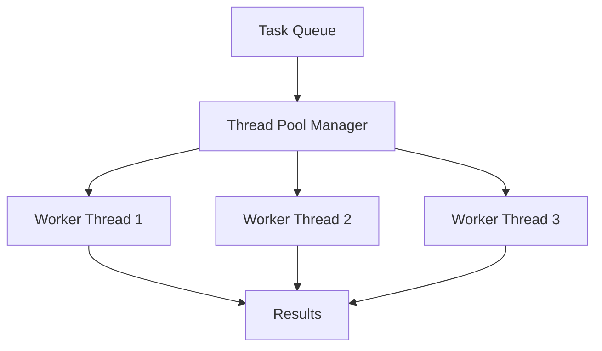

> [!WARNING]
> The Diagrams won't display as intended on Github Mobile.

1. Thread Lifecycle:

```mermaid
stateDiagram-v2
    [*] --> New: Thread created
    New --> Runnable: start()
    Runnable --> Running: scheduler selects
    Running --> Waiting: wait()/sleep()/block on I/O
    Waiting --> Runnable: notify()/timeout/I/O complete
    Running --> Runnable: yield()
    Running --> Terminated: run() completes
    Terminated --> [*]
```

2. Thread Synchronization:

```mermaid
sequenceDiagram
    participant Thread1
    participant Lock
    participant Thread2
    
    Thread1->>Lock: acquire lock
    activate Lock
    Note over Lock: Locked
    Thread2->>Lock: try to acquire lock
    Note over Thread2: Blocked
    Thread1->>Lock: release lock
    deactivate Lock
    Lock->>Thread2: lock available
    activate Lock
    Note over Lock: Locked
    Thread2->>Lock: release lock
    deactivate Lock
```

3. Producer-Consumer Pattern:

```mermaid
flowchart LR
    subgraph Producer Thread
    A[Producer] --> B[Shared Buffer]
    end
    
    subgraph Consumer Thread
    B --> C[Consumer]
    end
    
    B --> D[wait/notify]
    D --> B
```

4. Thread Pool Architecture:

```mermaid
graph TD
    A[Task Queue] --> B[Thread Pool Manager]
    B --> C[Worker Thread 1]
    B --> D[Worker Thread 2]
    B --> E[Worker Thread 3]
    C --> F[Results]
    D --> F
    E --> F
```
