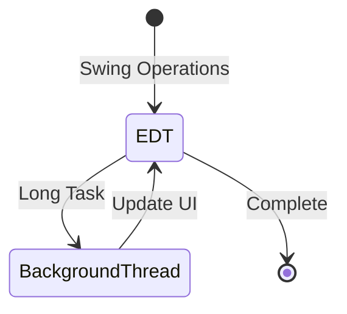

# Chapter - Java Threads and Event Dispatch Thread (EDT)
## What is a Thread?

- **Definition**: A thread is an independent unit of execution within a process. Multiple threads can share resources and run concurrently.
- **Examples**:
    - Video games use separate threads for graphics, user interaction, and networking.

## Advantages of Threads

- Simplifies programming by assigning one thread per task.
- Improves performance as threads only run when needed.
- Threads can utilize multiple processors if available.

## Core Components Overview
This summary covers thread creation methods, EDT interaction, and proper threading practices in Swing applications.

## Creating Threads
### Method 1: Extending Thread (mentioned for comparison)
```java
class MyThread extends Thread {
    public void run() { /* thread code */ }
}
```

### Method 2: Implementing Runnable (preferred)
```java
// Allows class to extend another class while still being runnable
class Output implements Runnable {
    private String message;
    
    public Output(String msg) {
        this.message = msg;
    }
    
    public void run() {
        try {
            while(true) {
                System.out.println(message);
                Thread.sleep(1000);
            }
        } catch(InterruptedException e) {
            System.out.println(e);
        }
    }
}

// Usage
Output out1 = new Output("Hello");
Thread thread1 = new Thread(out1);
thread1.start();
```

## Thread Control Methods
```java
// Essential thread operations and their purposes
thread.start();           // Begins thread execution
thread.wait();           // Pauses thread until notification
thread.notify();         // Wakes up waiting thread
thread.join();           // Waits for thread completion
thread.setPriority(n);   // Sets priority (MIN_PRIORITY to MAX_PRIORITY, default is NORM_PRIORITY)
```

## Event Dispatch Thread (EDT)
```java
// EDT handles all GUI events (mouse, keyboard, timer)
// Rule 1: All GUI operations must be on EDT
SwingUtilities.invokeLater(() -> {
    new JFrame().setVisible(true);  // Correct way to create/show GUI
});

// Rule 2: Never block EDT with long operations
// Wrong:
button.addActionListener(e -> {
    readHugeFile();  // Don't do this on EDT!
});

// Correct:
button.addActionListener(e -> {
    new Thread(() -> {
        String data = readHugeFile();
        SwingUtilities.invokeLater(() -> {
            textArea.setText(data);
        });
    }).start();
});
```

## SwingUtilities Methods
```java
// invokeAndWait - Blocks until EDT processes the request
SwingUtilities.invokeAndWait(() -> {
    label.setText("Updated");  // Waits for completion
});

// invokeLater - Posts request and returns immediately
SwingUtilities.invokeLater(() -> {
    label.setText("Updated");  // Non-blocking
});
```

## SwingWorker for Background Tasks
```java
class TaskWorker extends SwingWorker<String, Object> {
    @Override
    protected String doInBackground() {
        // Long running task here
        return result;
    }
    
    @Override
    protected void done() {
        try {
            label.setText(get());  // Updates UI with result
        } catch (Exception e) {
            e.printStackTrace();
        }
    }
}
```

## Complete Example
```java
public class ThreadDemo extends JFrame {
    private JLabel label;
    
    public ThreadDemo() {
        setTitle("Thread Demo");
        label = new JLabel("Processing...");
        add(label);
        
        JButton startButton = new JButton("Start Task");
        startButton.addActionListener(e -> startLongTask());
        add(startButton);
        
        setLayout(new FlowLayout());
        setDefaultCloseOperation(JFrame.EXIT_ON_CLOSE);
        pack();
    }
    
    private void startLongTask() {
        SwingWorker<String, Void> worker = new SwingWorker<>() {
            @Override
            protected String doInBackground() {
                try {
                    Thread.sleep(2000);  // Simulate work
                    return "Task Complete!";
                } catch (InterruptedException e) {
                    return "Task Interrupted!";
                }
            }
            
            @Override
            protected void done() {
                try {
                    label.setText(get());
                } catch (Exception e) {
                    label.setText("Error occurred!");
                }
            }
        };
        worker.execute();
    }
    
    public static void main(String[] args) {
        SwingUtilities.invokeLater(() -> {
            new ThreadDemo().setVisible(true);
        });
    }
}
```

## When `invokeLater` Is NOT Needed
- Before components are added to visible container
- Adding/removing event listeners
- Calling repaint()
- Methods explicitly marked as thread-safe
- `setText()` on `JTextComponent` and subclasses

## Thread Safety Rules
1. Never make Swing calls from non-EDT threads
2. Don't perform long operations on EDT
3. Use `SwingWorker` for background tasks
4. Always update UI components through EDT



## Best Practices
1. **Thread Creation**
   - Prefer Runnable over extending Thread
   - Handle `InterruptedException` properly
   - Use meaningful thread names
   - Clean up resources properly

2. **EDT Usage**
   - Keep EDT responsive
   - Never block EDT
   - Use appropriate invoke method
   - Handle exceptions properly

3. **Background Tasks**
   - Use `SwingWorker` for long operations
   - Update progress appropriately
   - Handle cancellation
   - Manage thread lifecycle

4. **Resource Management**
   - Close resources properly
   - Handle thread interruption
   - Manage thread pools effectively
   - Follow threading rules strictly

This summary covers all essential aspects of thread management and EDT interaction in Java Swing applications.